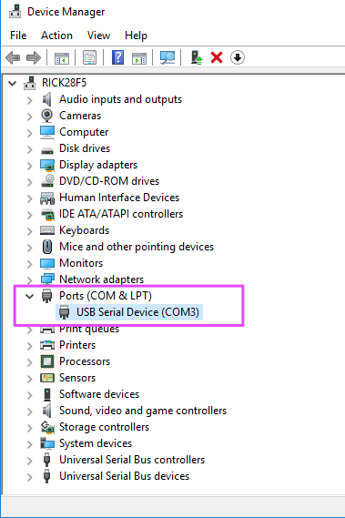
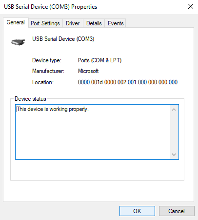
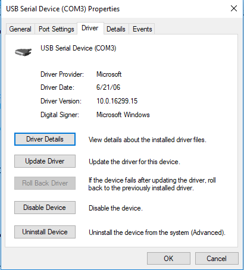
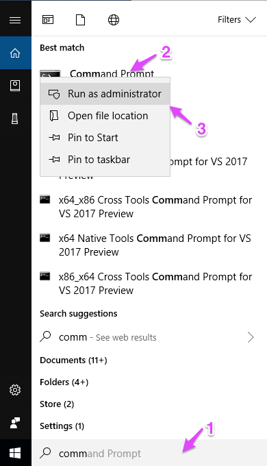
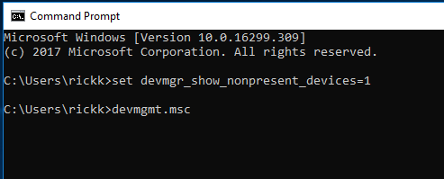
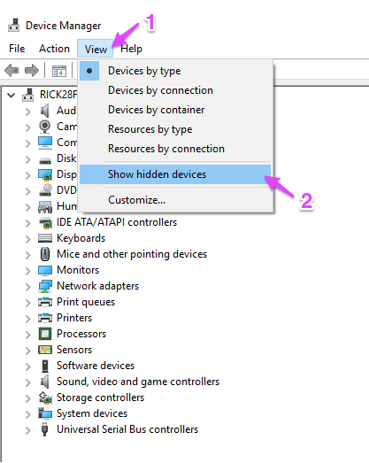
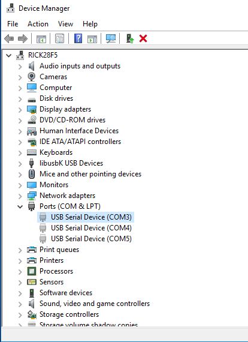

# Fixing Windows 10 Serial Drivers


This guide has some tips for debugging driver issues with Windows 10. There is a separate guide for [Windows 7](https://github.com/rickkas7/particle_notes/tree/master/debugging-windows-7-drivers).

## Getting Started

One common bit of confusion is that there are two different drivers used, one for normal operating mode with serial enabled and listening mode (blinking dark blue) that maps to a COM port, and a separate set of drivers for use in DFU mode (blinking yellow). It is possible for one set of drivers to work and not the other.

## COM Serial Driver

The COM port serial driver is used in normal operating mode (Serial object) and in listening mode (blinking dark blue). To check the serial drivers, open the **Device Manager**. The easiest way in Windows 10 is to type **Device** in the **Type here to search** box in the lower left corner of the screen next to the Windows button.

With a Photon or Electron (or a P1 with USB) connected, it should look like this in **Ports (COM & LPT)**.



If you view the USB Serial Device properties:



And the **Driver** tab in the properties:



Note that it should be using the Microsoft Windows serial driver.

### The Old Serial Driver

It's possible to have the old serial driver installed in Windows 10. If this happens, you should manually remove it.

If the device shows up as Photon or Electron, you probably still have the old driver installed.


You can tell for sure from the **Properties** as it will list **Particle** as the **Driver Provider**.


To remove the old driver, exit the Device Manager and disconnect all Particle devices from USB.

Open an Administrator Command Prompt. In the **Type here to search** box in the lower left corner of the screen next to the Windows button type **Command** (1). Right click on **Command Prompt** (2). Select **Run as administrator** (3).



In the command prompt, enter the commands:

```
set devmgr_show_nonpresent_devices=1
devmgmt.msc
```



Then from the Device Manager **View** menu (1), select **Show hidden devices** (2).



If your device list only shows **USB Serial Device** in **Ports (COM & LPT)** you don't have to do anything else. The correct driver is assigned.



However if you have Photon or Electron devices in the device list, you'll need to remove those devices.


Select the Photon or Electron item and hit the Delete key, or right-click and select **Uninstall**. The item will disappear. Repeat for all of the Photon or Electron items.

This should clear up any issues caused by having the old serial driver installed.


## DFU Drivers

The DFU drivers are only used when the Photon/P1/Electron/Core is blinking yellow. You typically enter DFU mode by holding down RESET and SETUP, releasing RESET and continuing to hold down SETUP while it blinks magenta until it blinks yellow, then release. (For the Electron and Core, the button is labeled MODE instead of SETUP.)

The easiest way to install the DFU drivers is to install the [Particle CLI](https://particle.io/cli), which should install the drivers for you.

If you are still having trouble using DFU, there are more tips in the [Installing DFU-util FAQ](https://docs.particle.io/faq/particle-tools/installing-dfu-util/).
