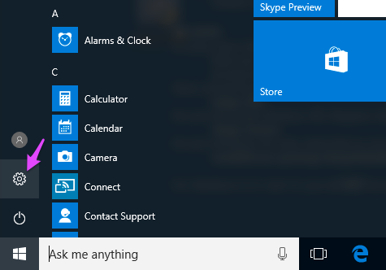
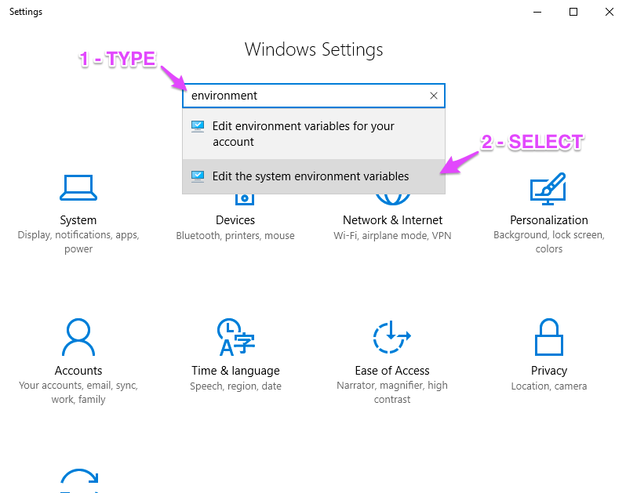
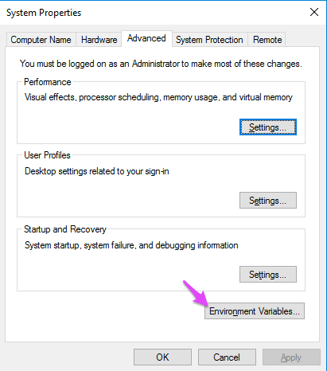
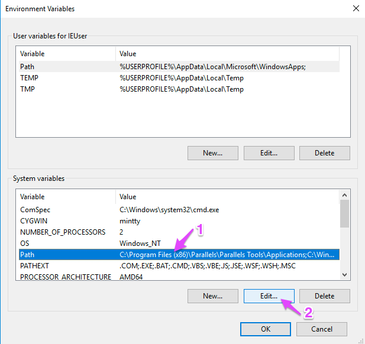
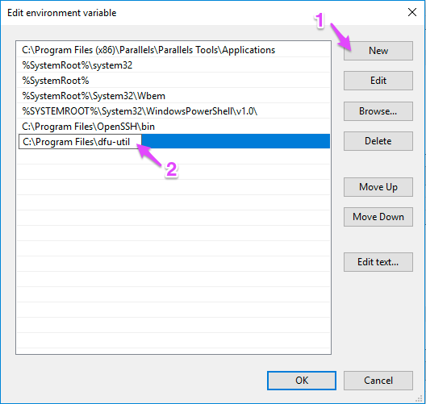
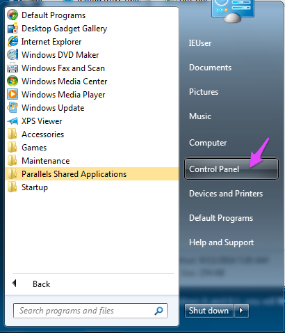
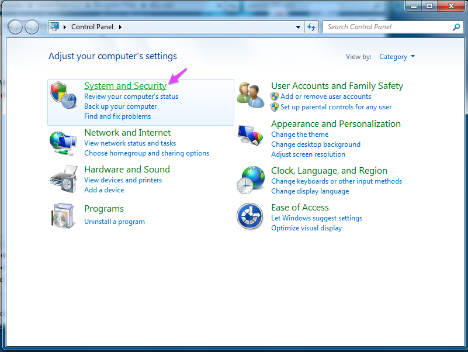
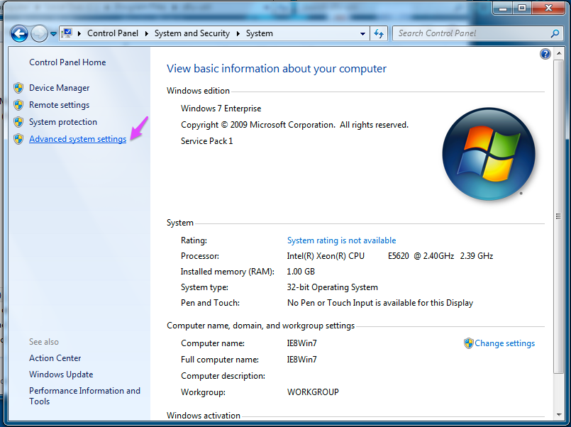
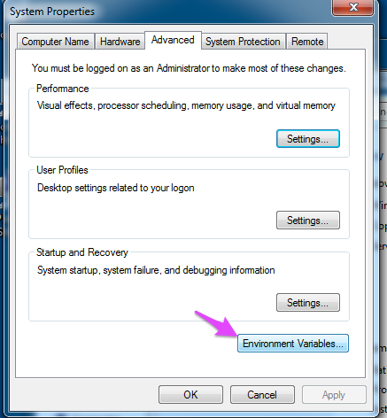
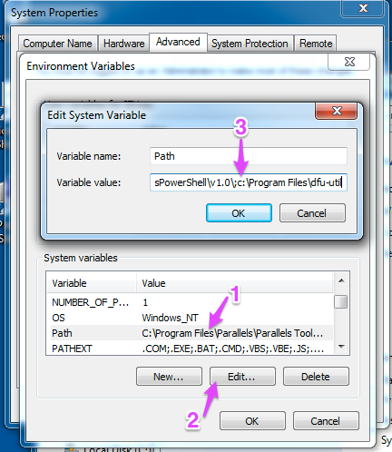

# Modifying your path

The path is a configuration setting that determines what directories contain programs you can execute from the command line.

## Windows 10

Click on the Windows Start menu, then the Settings (gear icon).



In the Windows 10 Settings window, type **environment** into the box at the top and select **Edit the system environment variables.**



Click the **Environment Variables** button at the bottom of the page.



In the **Environment Variables** window, select **Path** in the bottom list (System variables) and click Edit.



In the **Edit environment variable** window, click **New** then enter a new row in the table. In this example, I entered **C:\Program Files\dfu-util** but you should enter whatever path you want to add. It's OK for the path to contain spaces here.



After editing the system path environment variable you'll probably need to restart the computer.


## Windows 7 and Windows 8

You need to open the Control Panel. 



And then click on **System and Security**.



Then click **System**.


Then click on the **Advanced System Settings** link on the left side of the window.



Then click on **Environment Variables...**


 
Click on **Path** in the bottom list (System variables) and click Edit.

Finally, position the cursor at the end of the box and add the path you want to add. In this example, I entered **;C:\Program Files\dfu-util** but you should enter whatever path you want to add. 

There must be a semicolon separating the new item from the previous last item, and then the path to the directory we just created. It's OK for the path to contain spaces here.



After editing the system path environment variable you'll need to restart the computer or log out and log back in.

## Mac OS 

On the Mac, you edit the file ~/.profile, or the .profile in your home directory (such as /Users/rickk). 

On a completely new system you may need to create this file, otherwise just add the lines near the top of the file.

For example, here's how I added the path /usr/local/bin/gcc-arm/bin:

```
# ARM gcc toolchain
export PATH=$PATH:/usr/local/bin/gcc-arm/bin
```

Often you can just close all Terminal windows and reopen them, after making a .profile change.

## Linux

On the Linux, you edit the file ~/.profile, or the .profile in your home directory (such as /home/rickk). 

Just add the lines near the top of the file.

For example, here's how I added the path /usr/local/bin/gcc-arm/bin:

```
# ARM gcc toolchain
export PATH=$PATH:/usr/local/bin/gcc-arm/bin
```

You may need to log out and log back in after editing your .profile.

